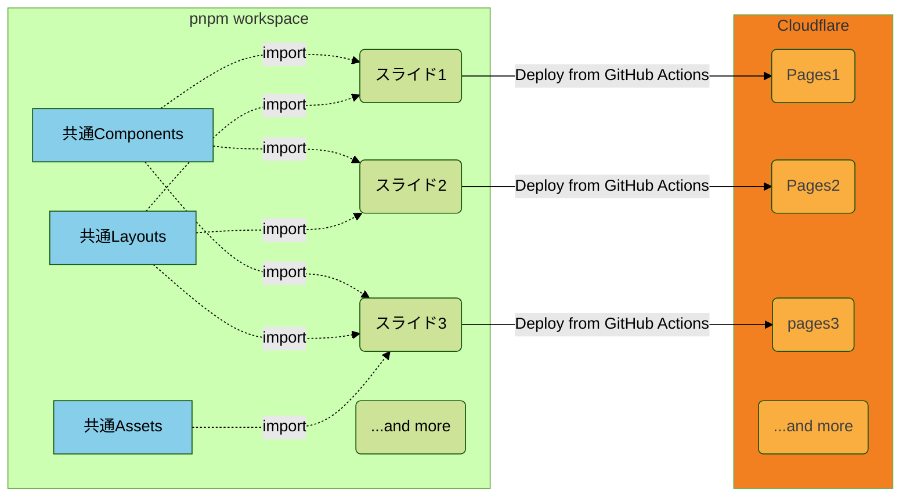

# manage multiple slidev in pnpm workspace

Manage multiple slides (used **slidev**) using pnpm workspace and deploy to **Cloudflare Pages**.

<div  align="center" style="display: grid; grid-template-columns: repeat(1, 1fr)">
  <div style="display: grid; grid-template-rows: subgrid">

[![Article][zenn-logo]][atricle-href]

  </div>
  <div style="display: grid; grid-template-rows: subgrid"> 
  
  [![ESLint][eslint-logo]][eslint-href]
  [![Textlint][textlint-logo]][textlint-href]
  [![Prettier][prettier-logo]][prettier-href]
  </div>
</div>

## WIP: Article

Look at [this article]().

## Architecture

必要に応じて共通コンポーネント/レイアウト/アセットをimportする



## Usage

### Build

```sh
slide=target pnpm build
```

### Development

show http://localhost:3000 .

```sh
slide=target pnpm dev
```

### Export to PDF

```sh
slide=target pnpm export
```

### Deploy to Cloudflare Pages

```sh
slide=target pnpm deploy:pages
```

## Linter

### ESLint

```sh
pnpm lint:eslint
# using --fix
pnpm lint:eslint:fix
```

### Textlint

```sh
pnpm lint:text
# using --fix
pnpm lint:text:fix
```

## LICENSE

This repository is licensed under [the MIT License](./LICENSE).

## Author

- GitHub: [@shinGangan](https://github.com/shinGangan)
- X: [@gangan_nikki]()

<!--
  Badges
-->

[zenn-logo]: https://img.shields.io/badge/Zenn-Show_article-0078D4.svg?style=plastic&logo=zenn
[atricle-href]: https://zenn.dev/gangannikki
[textlint-logo]: https://img.shields.io/badge/textlint-v13.4.x-F35776?style=plastic&logo=textlint&colorA=2AE2F2
[textlint-href]: https://textlint.github.io/
[eslint-logo]: https://img.shields.io/badge/ESLint-v8.54.x-4B32C3?style=plastic&logo=eslint
[eslint-href]: https://eslint.org/
[prettier-logo]: https://img.shields.io/badge/Prettier-v3.1.x-F7B93E?style=plastic&logo=prettier
[prettier-href]: https://prettier.io/
